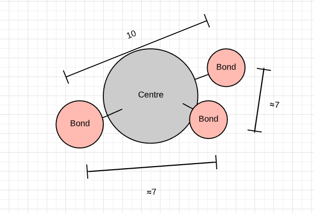

# Entry 6
##### 6/4/20

# Abstract
Over the quarantine time, I have completed my MVP and started to go further beyond.

# Engineering Design Process
I am currently **Testing** and **Improving** my prototype. I have implemented a GUI system that shows information to the user about what shape
they are seeing on the screen. <br>
For this to work, I have to deeply think about how am I going to program the computer to *determine* what shape is being created
by the user.

I came up with an idea that when the blue button was clicked, it will compare the *distance* between the sphere that appeared and every other
sphere. Since each mesh is object-like, there is a cool method to compare the distance bewteen two meshes:
```javascript
mesh1.position.subtract(mesh2.position).length();
```
What this code does is take the position of the first mesh (given by their x,y,z coordinate) and subtract the position of the second mesh.
The `.length()` at the end measures the *vector* created after subtracting the two meshes. <br>
All in all, in simplified terms, think of this code as vector or line that connects the center of 1 object to the center of the seocnd object
, and then take the measurement of its length.

This code is helpful because by adding together the measurements of the distances between meshes, the computer can understand the shape that is created.
Why it works? That is because the sum of the distances are different depending on which bond is formed. <br>
I coded it so that when a bond is formed, it will be pushed to a array. A nested for-loop will add up the distances for each individual bond
to each other.
```javascript
var total = 0;
for (var i=0; i<list.length; i++) {
    for (var k=0; k<list.length; k++) {
        total += Math.floor(list[k].position.subtract(list[i].position).length());
```
Although this code may not seem efficient, it is the only way (that I think of) to allow the program to determine the shape from
any angle or in other words, the same structure but positioned differently.

For example:

If this is a shape created by the user, then the total distance after looping through every bond is 48. No mattter which angle the user creates the
same shape, it will always be 48; it is like a id number.

# Knowledge

What I learned in class that applies to my project is **pseudo-code**. I approached this problem by writing out in plain english the steps
that a human being would take to determine what shape is produced. Of course, a computer cannot simiply imagine the shape produced
is similar to which geometric shape. I started out picking one bond, and then counting the number of adjacent bonds. And then determine
the shape based on the number of adjacent bonds counted. This process is even more inefficient than the one above and it is more difficult, so I went
back to the drawing board. I realized that the distance between the adjacent bonds are static no matter the position and each shape have a different total sum.
And so I wrote down, when a bond that is created or severed, sum the distance between every other bond. How I know whether or not a bond is created
is by storing it in an array. If the bond is severed, remove it from the array.

# Skills

The skills that I developed when finishing up this project is **problem decomposition** and **logical reasoning**. I used pseudo-code and drawing diagrams to help me organize my thoughts about how to approach the problem.
I broken down this problem by starting small and try to figure out how to find the distance between two meshes. I had some wild google chase
taking me from learning about vectors to ray casting. I used logical reasoning for how to add and splice meshes by using indexOf and flag variables.
 Flag variables were used to tell the program when is the right time to sum the distances. How I made the spheres disappear and reappear is to
 move them 1000 pixels away and return them back (I tried using instances from my previous blog entry but I can't seem to make them disappear individually, so I gave up and used the old fashion way).
 As a result, I have to time the mouse clicks to not have 1000 as a number showing up for the distances.
[Previous](entry05.md) | [Next](entry07.md)

[Home](../README.md)