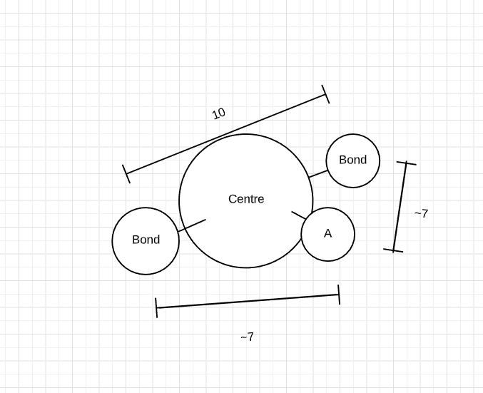

# Entry 6
##### 6/4/20

# Abstract
Over the quarantine time, I have completed my MVP and started to go further beyond.

# Engineering Design Process
I am currently **Testing** and **Improving** my prototype. I have implemented a GUI system that shows information to the user about what shape
they are seeing on the screen. <br>
For this to work, I have to deeply think about how am I going to program the computer to *determine* what shape is being created
by the user.

I came up with an idea that when the blue button was clicked, it will compare the *distance* between the sphere that appeared and every other
sphere. Since each mesh is object-like, there is a cool method to compare the distance bewteen two meshes:
```javascript
mesh1.position.subtract(mesh2.position).length();
```
What this code does is take the position of the first mesh (given by their x,y,z coordinate) and subtract the position of the second mesh.
The `.length()` at the end measures the *vector* created after subtracting the two meshes. <br>
All in all, in simplified terms, think of this code
as drawing a line from the center of 1 object to the center of the other object, and then measuring its length.

This code is helpful because by adding together the measurements of the distances between meshes, the computer can understand the shape that is created.
Why it works? That is because the sum of the distances are different depending on which bond is formed. <br>
I coded it so that when a bond is formed, it will be pushed to a array. A nested for-loop will add up the distances for each individual bond
to each other.




# Knowledge

# Skills

[Previous](entry05.md) | [Next](entry07.md)

[Home](../README.md)